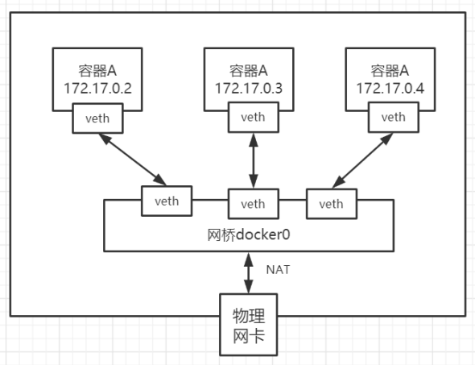

# Docker网络管理
## Docke网络模式

Docker有多少种网络模式

- Null(--net=None)

  - 把容器放入独立的网络空间但不做任何网络配 置

  - 用户需要通过运行docker network 命令来完成网络配置

-  Host
    ○ 使用主机网络名空间，复用主机网络

- Container
    ○ 重用其他容器的网络

-  Bridge(--net=bridge) 

  - 使用Linux网桥和iptable提供容器互联，Docker在每台主机上创建一个叫docker0的网桥，通过veth pair来连接该主机的每一个Endpoint

- `Overlay(libnetwork,libkv)`

  - 通过网络封包实现。

- `Remote(work with remote devices)`

  - Underlay：使用现有底层网络，为每一个容器配置可路由的网络IP
  - `Overlay`: 通过网络封包实现

  

  

---

## Docker网络原理

Docker使用Linux桥接，在宿主机虚拟一个Docker容器网桥(docker0)，Docker启动一个容器时会根据 
Docker网桥的网段分配给容器一个IP地址，称为Container-IP，同时Docker网桥是每个容器的默认网关。 
因为在同一宿主机内的容器都接入同一个网桥，这样容器之间就能够通过容器的Container-IP直接通信。
Docker容器网络就很好的利用了Linux虚拟网络技术，在本地主机和容器内分别创建一个虚拟接口，并让 
他们彼此联通（这样一对接口叫veth pair）；
Docker中的网络接口默认都是虚拟的接口。虚拟接口的优势就是转发效率极高（因为Linux是在内核中进 
行数据的复制来实现虚拟接口之间的数据转发，无需通过外部的网络设备交换），对于本地系统和容器 
系统来说，虚拟接口跟一个正常的以太网卡相比并没有区别，只是他的速度快很多。

### Docker桥接网路原理

1. 每一个安装了Docker的linux主机都有一个docker0的虚拟网卡。桥接网卡
2. 每启动一个容器linux主机多了一个虚拟网卡。
3. docker run -d -P --name tomcat --net bridge tomcat:8 
网络模式
网络模式	配置 	说明
bridge模式 	--net=bridge	默认值，在Docker网桥docker上为容器创建新的网络栈 
none模式	--net=none 	不配置网络，用户可以稍后进入容器，自行配置
container模 
式 	--net=container:name/id	容器和另外一个容器共Network namespace。 kubernetes中pod就是多个容器共享一个Network 
namespace
host模式	--net=host 	容器和宿主机共享Network namespace
用户自定义	--net=自定义网络	用户自己使用network相关命令定义网络

