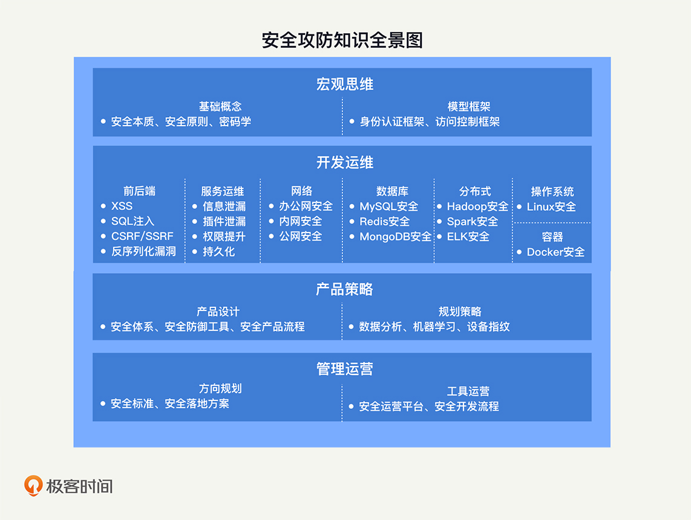
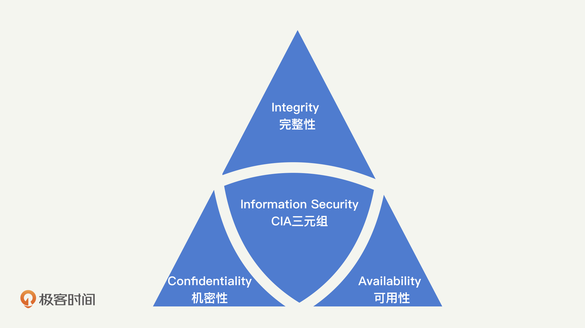
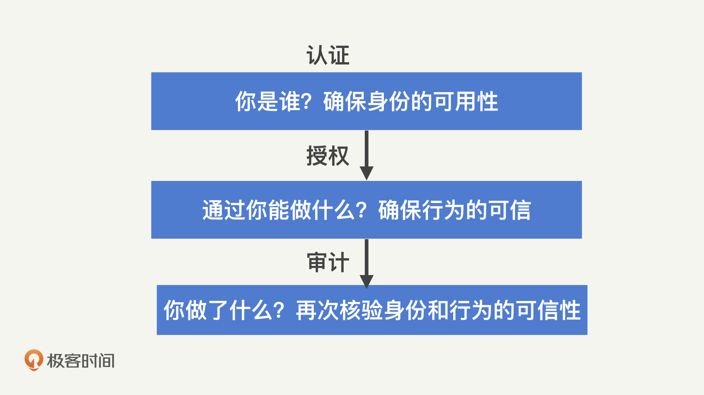

# 学习安全可能需要的知识

我们追求开发效率的同时，一定要把“安全”放在心上

## 01 | 怎么学习安全？

边开发边学习安全，实践出真知

## 02 | 什么是安全，安全问题的来源？

安全的本质是保护数据被合法的使用，怎么才能合法的使用呢？应该从机密性、完整性和可用性这三个方面出发。这是安全领域内最为基础的3个安全原则。

### 安全原则

机密性（Confidentiality）、完整性（Integrity）和可用性（Availability），我们可以简称为 CIA 三元组，是安全的基本原则。理论上来说，一个完整的安全保障体系，应该充分考虑到所有的 CIA 原则。当然，实际情况中，我们会根据企业需求，对安全在这三个方向上的投入做取舍。我们平时在评判一个企业的安全水平时，也会分别从这三个方向进行考量。

#### 1.机密性

**机密性：确保数据只被授权的主题访问，不被任何未授权的主体访问**，即**不可见**。

数据的存储、传输和处理过程也需要受到应有的保护，这些技术包括：加密、隔离、混淆、隐藏等等。

有时会直接针对保护技术进行破解。如去破解解密算法、去逆向混淆代码等等。站在巨人的肩膀上，在保护的技术上，我们不需要投入太多，只需要采用最新的技术即可。

更多的时候，我们面临的机密性攻击，其实是人为原因导致的疏忽，也就是错误使用访问控制机制或数据保护技术。比如，因为权限滥用，导致开发人员拥有敏感数据的无限制访问权限；因为弱密钥，导致加密被破解；甚至显示器上的数据被别有用心的人窥探。所以说，**当前机密性保护的要点是引导人去做正确的事情，避免这类看似低级、实则普遍的漏洞发生。**

#### 2.完整性

**完整性就是确保数据只被授权的主体进行授权的修改**，即**不可改**

一般机密性和完整性是共同出现的，做好了机密性保护，基本上意味着做好了完整性的保护。因此，在谈论安全问题和建设安全体系时，要将这两者结合起来。

#### 3.可用性

**可用性就是保护数据能够被授权的主体访问**，即**可读性**。

在不同的企业，不同的发展阶段，CIA都会有不同的有限级别。

- 在运维层面上，有很多技术在为可用性提供支撑，比如，在基础建设上的机房建设（如何在断电、高温、火灾等情况下保护设备）、多地冗余，以及在服务中的备份、资源冗余等。
- 在研发层面上，如何降低响应延迟、如何处理海量数据、如何在峰值进行扩容等，这些问题其实都是在可用性上的挑战。
- 在攻击的角度上，黑客也会对可用性发起攻击，也就是我们常说的 DoS（Denial of Service，拒绝服务）攻击。比如，通过发送大量的流量来占满带宽资源。

## 03 | 如何解决安全问题？

如何解决安全呢？具体问题具体分析，但基础的东西是不变的，对于授权：**少就是多**，从入口来解决问题。

### 黄金原则

- 识别（Identification）

- 认证（Authentication）

- 授权（Authorization）

- 审计（Audit）

- 问责（Accounting）

更高层次的概括：将识别和认证、审计和问责归纳到一起，而强调这两两之间的协同性质。即

- 认证
- 授权
- 审计

用户在使用应用的生命周期：先进行登录、再进行操作，而后留下记录。

  

**事先防御属于认证，事中防御属于授权，事后防御属于审计。**

**安全问题需要自上而下的方式去进行管理和推动。**只有企业高层了解了安全，才有可能有效推动安全的发展。

